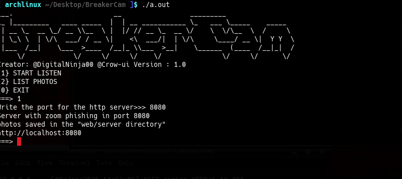
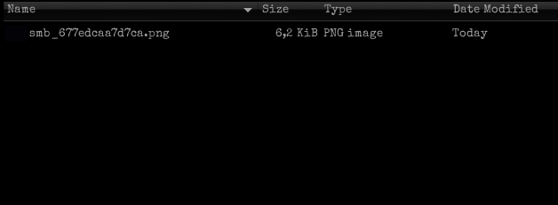
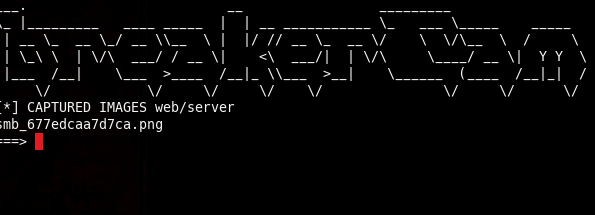
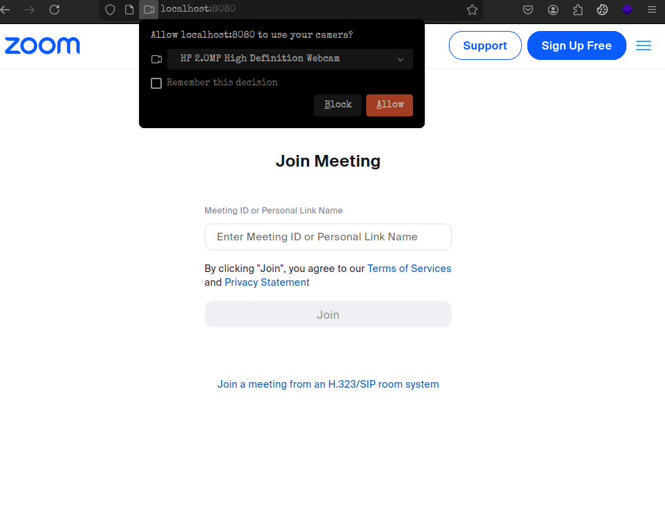

# BreakerCam version: 1.0
<center>
    <br>
    <br>
    <br>
</center>
* 
### Fake zoom site and camera access request
<center>
    <br>
</center>
### Tool to capture a user's camera
#### For arch based distros and Debian distros
### For Arch based distros

```
sudo pacman -S gcc
sudo pacman -S php
mkdir web/server
```

#### For debian based distros
```
sudo apt -y install g++
sudo apt -y install php
mkdir web/server

```
### compile, execute
```
g++ main.cpp -o breakercam
chmod +x breakercam
./breakercam
```
## Authors
@DigitalNinja00
